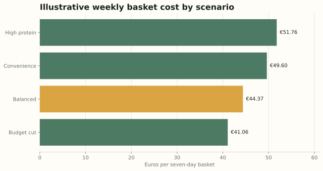
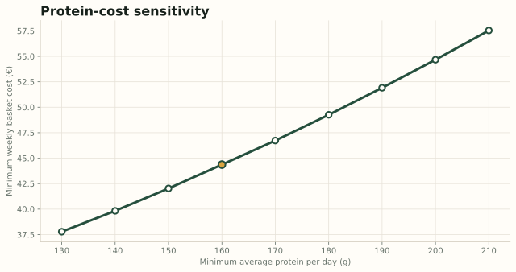

# Protein Thinking

**A cost-constrained student meal-planning optimiser built with Python, mixed-integer programming and SQL.**

After building a neighbourhood-ranking project, I wanted my second Business Analytics portfolio project to demonstrate a different kind of decision problem: optimisation under competing constraints.

The question is:

> What is the lowest-cost seven-day grocery basket that satisfies an average nutrition target while remaining varied and practical?

The project uses a two-stage mixed-integer model. Stage 1 finds the minimum-cost weekly basket. Stage 2 keeps that basket fixed and arranges it across seven days while reducing variation in nutrition and preparation time.



## Headline findings

Under the versioned illustrative catalogue:

| Scenario | Weekly cost | Average protein | Average prep | Distinct foods |
|---|---:|---:|---:|---:|
| Budget cut | €41.06 | 150.0 g/day | 58.6 min/day | 16 |
| Balanced | €44.37 | 160.1 g/day | 55.0 min/day | 18 |
| Convenience | €49.60 | 160.4 g/day | 35.0 min/day | 21 |
| High protein | €51.76 | 190.0 g/day | 59.6 min/day | 19 |

The controlled protein sensitivity test shows a clear cost trade-off:

- 130 g/day protein floor: **€37.78/week**
- 160 g/day protein floor: **€44.37/week**
- 210 g/day protein floor: **€57.54/week**

Within this model, moving from 130 g to 210 g adds **€19.76 per week**.



These are optimisation results from the same illustrative price catalogue. They are not claims about every real shopping basket.

## What the project demonstrates

- Mixed-integer linear programming with SciPy/HiGHS
- A two-stage optimisation design separating purchasing from scheduling
- Scenario and sensitivity analysis
- Transparent KPI and constraint design
- Python data pipelines and automated validation
- SQL analysis through a reproducible SQLite database
- An executed Jupyter notebook with embedded outputs
- A responsive, self-contained interactive HTML dashboard
- Honest documentation of assumptions and limitations

## Interactive dashboard

The dashboard is in [`dashboard/index.html`](dashboard/index.html). It is self-contained: clone or download the repository and open that file directly in a browser.

It includes:

- selectable balanced, budget, high-protein and convenience scenarios;
- scenario cost comparison;
- the nine-point protein-cost frontier;
- average nutrition and preparation KPIs;
- an illustrative seven-day schedule; and
- an auditable grocery list ranked by cost contribution.

## Model design

### Stage 1: optimise the weekly basket

Integer serving counts minimise weekly cost subject to:

- average calorie bounds;
- minimum average protein and fibre;
- average fat bounds;
- an average preparation-time cap;
- minimum food variety;
- exactly seven dinner-protein servings;
- at least four distinct dinner-protein choices;
- breakfast, carbohydrate and produce coverage; and
- weekly caps for each food, fish and red meat.

The basket optimiser reaches a **0% reported MIP gap** for all four portfolio scenarios.

### Stage 2: schedule the fixed basket

A second integer model allocates the purchased servings across Monday–Sunday. Its objective is to reduce daily deviation in energy, protein, fibre, fat and preparation time while respecting broad daily guardrails.

The hard nutrition claims therefore apply to the **weekly average**. The day-level schedule is an illustrative arrangement, not a guarantee that every day independently reaches every weekly-average target.

Full mathematical and scenario detail is in [METHODOLOGY.md](METHODOLOGY.md).

## Data policy

`data/raw/food_catalog.csv` contains 29 common foods with serving sizes, nutrition values, preparation assumptions and prices.

The catalogue is deliberately labelled **illustrative**:

- prices are representative Dutch retail assumptions, not a live supermarket feed;
- nutrition values are typical label values, not a medical database;
- package sizes, promotions and brands are not modelled; and
- the catalogue must be replaced or verified before any real purchasing decision.

This keeps the project reproducible without presenting synthetic precision as current market evidence.

## Repository structure

```text
protein-thinking/
├── assets/                     # GitHub and LinkedIn charts
├── dashboard/                  # Interactive self-contained dashboard
├── data/
│   ├── raw/food_catalog.csv    # Versioned illustrative inputs
│   └── processed/              # Plans, summaries, sensitivity and SQLite DB
├── notebooks/analysis.ipynb    # Executed reader-facing analysis
├── sql/analysis_queries.sql    # Five business questions in SQL
├── src/
│   ├── config.py               # Scenario definitions
│   ├── optimizer.py            # Two-stage MILP
│   ├── run_analysis.py         # Output pipeline
│   ├── build_dashboard.py      # Dashboard builder
│   ├── build_notebook.py       # Notebook builder/executor
│   ├── create_figures.py       # Reproducible charts
│   └── validate_outputs.py     # Analytical validation
└── tests/test_optimizer.py     # Model regression tests
```

## Run the project

```bash
python -m venv .venv

# Windows
.venv\Scripts\activate

# macOS/Linux
source .venv/bin/activate

pip install -r requirements.txt
python -m src.run_analysis
python -m src.build_dashboard
python -m src.create_figures
python -m src.validate_outputs
python -m unittest discover -s tests -v
python -m src.build_notebook
```

The generated SQLite database is `data/processed/protein_thinking.db`. The example queries in `sql/analysis_queries.sql` cover scenario comparison, cost concentration, protein sensitivity and schedule variation.

## Validation status

- 4 model regression tests pass.
- 26 analytical validation checks pass.
- All four weekly basket problems report a 0% optimality gap.
- The protein-cost frontier is monotonic across all nine tested thresholds.
- The dashboard renders four scenarios, seven daily cards and nine sensitivity points without JavaScript errors in automated DOM checks.
- The notebook contains five executed code cells and no error outputs.

## Limitations and next steps

The most useful next step is replacing the illustrative catalogue with timestamped, verified product observations from Dutch supermarkets. That would allow:

- package-size and unit-price modelling;
- store and promotion comparisons;
- price refresh dates and change tracking;
- a user-editable nutrition target; and
- an uncertainty analysis for changing prices.

The project is a decision-modelling demonstration, not dietary or medical advice.

